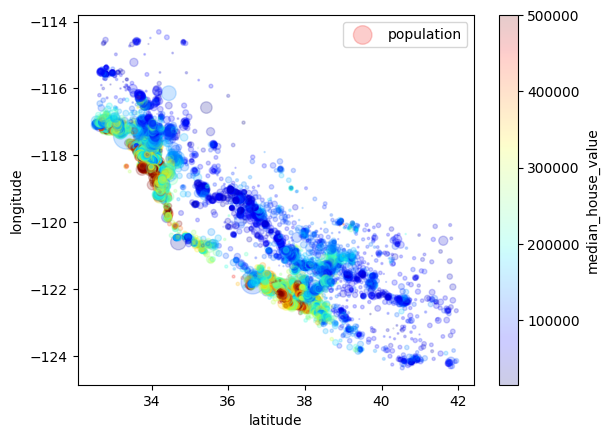
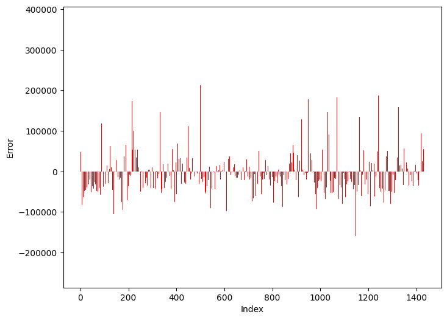

# California House Price Prediction

## Project Overview
The goal of this project is to predict the median house value in California based on various features such as location, number of rooms, population, and median income. The project involves:
- Data cleaning and preprocessing.
- Exploratory Data Analysis (EDA) to understand the dataset.
- Training and evaluating multiple machine learning models, including Linear Regression, Random Forest, and a simple Neural Network.

---

## Dataset
The dataset used in this project is the **California Housing Dataset**, which contains the following features:
- **longitude**: Longitude of the location.
- **latitude**: Latitude of the location.
- **housing_median_age**: Median age of the houses.
- **total_rooms**: Total number of rooms in the area.
- **total_bedrooms**: Total number of bedrooms in the area.
- **population**: Population of the area.
- **households**: Number of households in the area.
- **median_income**: Median income of the households.
- **median_house_value**: Median house value (target variable).
- **ocean_proximity**: Proximity to the ocean (categorical feature).

---

## Data Preprocessing
- **Handling Missing Values**: Missing values in the `total_bedrooms` feature were handled by dropping rows with null values.
- **Encoding Categorical Variables**: The `ocean_proximity` feature was one-hot encoded to convert it into numerical format.
- **Feature Scaling**: Numerical features were standardized using `StandardScaler` to ensure all features were on the same scale.

---

## Exploratory Data Analysis (EDA)
- **Distribution of Features**: Histograms were plotted to understand the distribution of numerical features.
- **Geographical Visualization**: Scatter plots were used to visualize the geographical distribution of houses and their prices.
- **Correlation Analysis**: A correlation matrix was used to identify the relationship between features and the target variable (`median_house_value`).

---

## Model Training
Three models were trained and evaluated:
1. **Linear Regression**:
   - Used as a baseline model.
   - Achieved an R-squared value of **0.633** on the training set.
   - Mean error on the validation set: **69,916**.

2. **Random Forest Regressor**:
   - Achieved a mean error of **71,496** on the validation set.

3. **Simple Neural Network**:
   - A basic neural network with two hidden layers was implemented using TensorFlow/Keras.
   - The model was trained using the Adam optimizer and evaluated using Root Mean Squared Error (RMSE).

---

## Results
- **Linear Regression** performed reasonably well but showed some underestimation and overestimation of house prices.
- **Random Forest** improved the predictions slightly but still had room for improvement.
- **Neural Network** was implemented to explore more complex relationships in the data, but further tuning is required for better performance.

---

## Technologies Used
- **Python**: Primary programming language.
- **Pandas**: Data manipulation and analysis.
- **NumPy**: Numerical computations.
- **Matplotlib & Seaborn**: Data visualization.
- **Scikit-learn**: Machine learning models and evaluation.
- **TensorFlow/Keras**: Neural network implementation.

---

## Future Work
- Experiment with more advanced models like Gradient Boosting or Deep Learning.
- Perform hyperparameter tuning to improve model performance.
- Explore feature engineering to create new features that could improve predictions.
